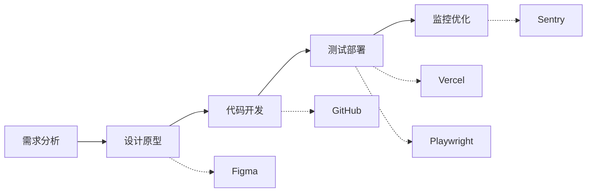
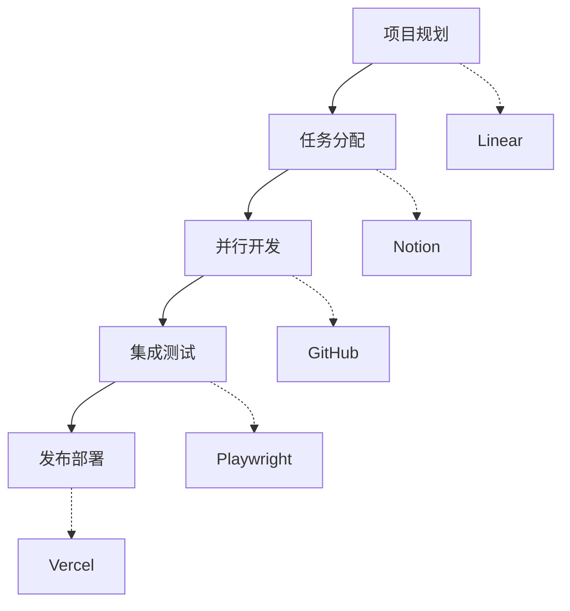

# Cursor MCP 官方推荐工具详解
{: .fs-9 }

全面掌握 Cursor MCP 生态，官方推荐工具深度解析与实战指南
{: .fs-6 .fw-300 }

## 📖 什么是 MCP？

MCP (Model Context Protocol，模型上下文协议) 是 Cursor 提供的一个强大的扩展机制，允许将编辑器与外部工具和数据源进行深度集成。通过 MCP，开发者可以：

* 🔗 **无缝集成**：连接各种开发工具和服务
* 🤖 **智能协作**：让 AI 直接访问和操作外部系统
* 🚀 **效率提升**：在编辑器内完成更多工作，减少工具切换
* 🔧 **功能扩展**：为 Cursor 添加无限可能的新功能

## 🛠️ 官方推荐 MCP 工具清单

### 📝 文档与协作类

#### 1. Notion - 智能笔记与文档管理
**功能特点：**
- 📋 在 Cursor 内直接访问 Notion 页面和数据库
- ✍️ 同步编辑和更新文档内容
- 🔍 快速搜索和检索 Notion 中的信息
- 📊 管理项目文档和知识库

**使用场景：**
- 项目文档管理
- 技术规范编写
- 团队知识共享
- 需求和设计文档维护

**配置示例：**
```json
{
  "mcpServers": {
    "notion": {
      "command": "npx",
      "args": ["@modelcontextprotocol/server-notion"],
      "env": {
        "NOTION_API_KEY": "your-notion-api-key"
      }
    }
  }
}
```

#### 2. Atlassian - Jira & Confluence 集成
**功能特点：**
- 🎫 直接在编辑器中管理 Jira 任务
- 📖 访问和编辑 Confluence 文档
- 🔄 同步项目状态和进度
- 📈 跟踪开发任务和 bug

**使用场景：**
- 敏捷开发管理
- 项目进度跟踪
- 文档协作编写
- 问题跟踪和解决

### 🎨 设计与原型类

#### 3. Figma - 设计协作利器
**功能特点：**
- 🎨 在编辑器中查看和编辑 Figma 设计
- 📐 获取设计规范和组件信息
- 🔄 设计与代码同步更新
- 👥 设计师与开发者协作

**使用场景：**
- UI/UX 设计实现
- 设计规范查询
- 组件库开发
- 设计评审和反馈

**配置示例：**
```json
{
  "mcpServers": {
    "figma": {
      "command": "npx",
      "args": ["@modelcontextprotocol/server-figma"],
      "env": {
        "FIGMA_ACCESS_TOKEN": "your-figma-token"
      }
    }
  }
}
```

### 📊 项目管理类

#### 4. Linear - 现代项目管理
**功能特点：**
- 📋 管理项目任务和里程碑
- 🔄 同步开发进度
- 📈 跟踪团队效率指标
- 🎯 设置和管理项目目标

**使用场景：**
- 敏捷开发管理
- 任务分配和跟踪
- 团队协作
- 项目进度监控

### 🔧 开发工具类

#### 5. GitHub - 版本控制之王
**功能特点：**
- 📦 仓库管理和操作
- 🔀 Pull Request 创建和审核
- 🐛 Issue 管理和跟踪
- 📊 代码统计和分析

**使用场景：**
- 代码版本管理
- 团队协作开发
- 开源项目贡献
- 代码审查流程

**配置示例：**
```json
{
  "mcpServers": {
    "github": {
      "command": "npx",
      "args": ["@modelcontextprotocol/server-github"],
      "env": {
        "GITHUB_PERSONAL_ACCESS_TOKEN": "your-github-token"
      }
    }
  }
}
```

#### 6. GitLab - 企业级 DevOps 平台
**功能特点：**
- 🔄 完整的 CI/CD 流程管理
- 🛡️ 安全扫描和合规检查
- 📊 项目分析和报告
- 👥 团队协作和权限管理

**使用场景：**
- 企业级项目开发
- DevOps 流程自动化
- 安全合规管理
- 团队协作开发

### 🧪 测试与质量类

#### 7. Playwright - 端到端测试专家
**功能特点：**
- 🌐 跨浏览器自动化测试
- 📱 移动端测试支持
- 📊 测试报告生成
- 🔧 测试脚本管理

**使用场景：**
- Web 应用测试
- API 接口测试
- 性能测试
- 回归测试自动化

**配置示例：**
```json
{
  "mcpServers": {
    "playwright": {
      "command": "npx",
      "args": ["@modelcontextprotocol/server-playwright"]
    }
  }
}
```

#### 8. Sentry - 错误监控与性能追踪
**功能特点：**
- 🐛 实时错误监控和报告
- 📈 性能指标追踪
- 🔍 错误堆栈分析
- 📊 用户体验监控

**使用场景：**
- 生产环境监控
- 错误诊断和修复
- 性能优化
- 用户体验改善

### 🚀 部署与运维类

#### 9. Vercel - 现代化部署平台
**功能特点：**
- ⚡ 快速部署和预览
- 🌍 全球 CDN 加速
- 🔄 自动化部署流程
- 📊 部署分析和监控

**使用场景：**
- 前端项目部署
- 静态站点托管
- 预览环境管理
- 性能优化

**配置示例：**
```json
{
  "mcpServers": {
    "vercel": {
      "command": "npx",
      "args": ["@modelcontextprotocol/server-vercel"],
      "env": {
        "VERCEL_API_TOKEN": "your-vercel-token"
      }
    }
  }
}
```

### 📊 数据分析类

#### 10. DuckDB - 嵌入式分析数据库
**功能特点：**
- 🦆 高性能 OLAP 查询
- 📊 数据分析和处理
- 🔄 与各种数据源集成
- 📈 实时数据查询

**使用场景：**
- 数据分析和报告
- 日志分析
- 业务指标计算
- 数据探索

#### 11. PostHog - 产品分析平台
**功能特点：**
- 📊 用户行为分析
- 🔍 事件追踪和漏斗分析
- 🧪 A/B 测试管理
- 📈 产品指标监控

**使用场景：**
- 产品数据分析
- 用户行为研究
- 功能效果评估
- 产品优化决策

### 💰 商业应用类

#### 12. Stripe - 支付处理专家
**功能特点：**
- 💳 支付流程集成
- 📊 交易数据分析
- 🔒 安全支付处理
- 📈 收入监控和报告

**使用场景：**
- 电商支付集成
- 订阅服务管理
- 财务数据分析
- 支付安全监控

**配置示例：**
```json
{
  "mcpServers": {
    "stripe": {
      "command": "npx",
      "args": ["@modelcontextprotocol/server-stripe"],
      "env": {
        "STRIPE_API_KEY": "your-stripe-api-key"
      }
    }
  }
}
```

## 🚀 MCP 工具配置指南

### 基础配置步骤

#### 1. 安装 MCP 服务器
```bash
# 全局安装常用的 MCP 服务器
npm install -g @modelcontextprotocol/server-github
npm install -g @modelcontextprotocol/server-notion
npm install -g @modelcontextprotocol/server-figma
```

#### 2. 配置 Cursor 设置
在 Cursor 的设置文件中添加 MCP 配置：

```json
{
  "mcpServers": {
    "github": {
      "command": "npx",
      "args": ["@modelcontextprotocol/server-github"],
      "env": {
        "GITHUB_PERSONAL_ACCESS_TOKEN": "your-token"
      }
    },
    "notion": {
      "command": "npx",
      "args": ["@modelcontextprotocol/server-notion"],
      "env": {
        "NOTION_API_KEY": "your-api-key"
      }
    }
  }
}
```

#### 3. 获取 API 密钥
每个服务都需要相应的 API 密钥或访问令牌：

- **GitHub**: Personal Access Token
- **Notion**: Integration Token
- **Figma**: Personal Access Token
- **Stripe**: API Key
- **Vercel**: API Token

### 高级配置技巧

#### 环境变量管理
```bash
# 创建 .env 文件管理敏感信息
GITHUB_TOKEN=your-github-token
NOTION_API_KEY=your-notion-key
FIGMA_TOKEN=your-figma-token
```

#### 条件配置
```json
{
  "mcpServers": {
    "development": {
      "github": { /* 开发环境配置 */ },
      "notion": { /* 开发环境配置 */ }
    },
    "production": {
      "github": { /* 生产环境配置 */ },
      "vercel": { /* 生产环境配置 */ }
    }
  }
}
```

## 💡 最佳实践与使用技巧

### 🎯 选择合适的工具组合

#### 前端开发推荐组合
```
GitHub + Vercel + Figma + Sentry + PostHog
```

#### 全栈开发推荐组合
```
GitHub + Notion + Linear + Playwright + DuckDB
```

#### 企业开发推荐组合
```
GitLab + Atlassian + Sentry + Stripe + PostHog
```

### 🔧 配置优化建议

1. **性能优化**
   - 只启用必需的 MCP 服务器
   - 合理设置缓存策略
   - 监控资源使用情况

2. **安全考虑**
   - 使用环境变量存储敏感信息
   - 定期轮换 API 密钥
   - 限制 API 权限范围

3. **团队协作**
   - 统一团队 MCP 配置
   - 建立配置管理规范
   - 定期更新和维护

### 🚀 实战应用场景

#### 场景1：全栈项目开发


#### 场景2：团队协作开发


## 🔍 故障排除与常见问题

### 常见配置问题

#### 1. MCP 服务器启动失败
```bash
# 检查 Node.js 版本
node --version

# 重新安装 MCP 服务器
npm uninstall -g @modelcontextprotocol/server-github
npm install -g @modelcontextprotocol/server-github
```

#### 2. API 认证失败
- 检查 API 密钥是否正确
- 确认 API 权限设置
- 验证环境变量配置

#### 3. 连接超时问题
- 检查网络连接
- 调整超时设置
- 使用代理服务器

### 调试技巧

#### 启用调试模式
```json
{
  "mcpServers": {
    "github": {
      "command": "npx",
      "args": ["@modelcontextprotocol/server-github", "--debug"],
      "env": {
        "DEBUG": "mcp:*"
      }
    }
  }
}
```

#### 查看日志输出
```bash
# 查看 Cursor 日志
tail -f ~/.cursor/logs/main.log

# 查看 MCP 服务器日志
tail -f ~/.cursor/logs/mcp-*.log
```

## 🔮 未来发展与扩展

### 即将推出的 MCP 工具

- **Docker**: 容器管理和部署
- **Kubernetes**: 集群管理和监控  
- **AWS/Azure**: 云服务集成
- **Slack**: 团队沟通集成
- **Jira**: 更深度的项目管理

### 自定义 MCP 开发

如果官方工具不能满足需求，您也可以开发自定义的 MCP 服务器：

```typescript
import { Server } from '@modelcontextprotocol/sdk/server/index.js';

const server = new Server(
  {
    name: "custom-mcp-server",
    version: "1.0.0"
  },
  {
    capabilities: {
      resources: {},
      tools: {}
    }
  }
);

// 实现自定义功能
server.setRequestHandler(/* ... */);
```

## 📚 延伸阅读

- [Cursor 官方文档](https://docs.cursor.com)
- [MCP 协议规范](https://modelcontextprotocol.io)
- [GitHub MCP 服务器](https://github.com/modelcontextprotocol/servers)

---

## 🎯 总结

通过合理配置和使用这些官方推荐的 MCP 工具，您可以：

* 🚀 **大幅提升开发效率**：减少工具切换，在 Cursor 内完成更多工作
* 🔗 **实现无缝集成**：将各种开发工具和服务深度整合
* 🤖 **增强 AI 能力**：让 AI 助手能够访问和操作更多外部系统
* 👥 **优化团队协作**：统一工具链，提升团队协作效率

选择适合您项目需求的 MCP 工具组合，开始您的高效 AI 辅助开发之旅吧！

---

**下一章预告**：[02-Cursor-基础操作.md] - 深入了解 Cursor 的基础功能和操作技巧

[🏠 返回首页](README.md) | [📝 提出建议](https://github.com/cursor-chinese-guide/cursor-chinese-guide/issues) | [⭐ 给我们 Star](https://github.com/cursor-chinese-guide/cursor-chinese-guide)
